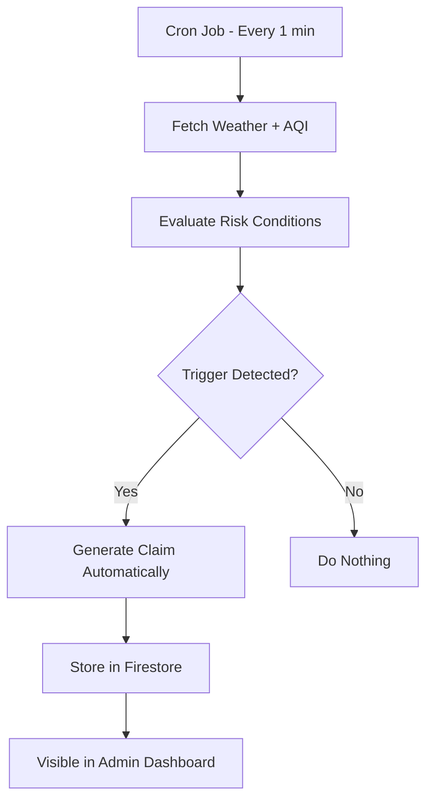

# 🚀 GigAssure – Phase 2: Automation & Protection

> **Theme:** Protect Your Worker
> Real-time insurtech platform powered by environmental intelligence 🌍

---

## 📌 Overview

GigAssure is a smart insurance system for gig workers that uses **live weather + AQI data** to:

* Adjust premiums dynamically 💰
* Detect risks automatically ⚠️
* Generate claims with **zero user effort** 🤖

---

## 🎯 Phase 2 Deliverables Status

| Feature              | Status | Description                            |
| -------------------- | ------ | -------------------------------------- |
| Registration Process | ✅      | Firebase-based user system             |
| Policy Management    | ✅      | Policies stored & managed in Firestore |
| Dynamic Premium      | ✅      | Based on weather + AQI                 |
| Claims Management    | ✅      | Full admin workflows                   |
| Automation Engine    | ✅      | Cron-based trigger system              |
| Zero-touch Claims    | ✅      | Auto claim generation                  |

---

## 🛠️ Tech Stack

| Layer     | Technology         |
| --------- | ------------------ |
| Backend   | Node.js, Express   |
| Database  | Firebase Firestore |
| Auth      | Firebase JWT       |
| APIs      | Open-Meteo         |
| Scheduler | Node Cron          |

---

## ⚙️ API Overview

### 📄 Claims APIs

| Method | Endpoint            | Description       |
| ------ | ------------------- | ----------------- |
| GET    | `/api/admin/claims` | Fetch all claims  |
| PATCH  | `/approve`          | Approve claim     |
| PATCH  | `/reject`           | Reject claim      |
| POST   | `/simulate`         | Create test claim |

---

### 👷 Worker APIs

| Method | Endpoint             | Description     |
| ------ | -------------------- | --------------- |
| GET    | `/api/admin/workers` | Get all workers |
| PATCH  | `/flag`              | Flag worker     |
| PATCH  | `/unflag`            | Remove flag     |

---

### 📊 Dashboard APIs

| Endpoint                  | Description        |
| ------------------------- | ------------------ |
| `/api/admin`              | KPI summary        |
| `/api/admin/intelligence` | Advanced analytics |

---

### 💰 Premium API

| Method | Endpoint                 | Description     |
| ------ | ------------------------ | --------------- |
| POST   | `/api/calculate-premium` | Dynamic pricing |

---

## 🤖 Automation Flow (Core Highlight)



---

## 🌦️ Trigger System

| Trigger         | Condition               |
| --------------- | ----------------------- |
| 🔥 Extreme Heat | High temperature        |
| 🌧️ Heavy Rain  | Rain threshold exceeded |
| 🌫️ Pollution   | AQI above limit         |

---

## 🧠 AI-Based Premium Logic

| Condition      | Effect             |
| -------------- | ------------------ |
| Safe Zone      | Lower premium      |
| High Risk Area | Higher premium     |
| Bad Weather    | Increased coverage |

---

## 🏗️ Project Structure

```
backend/
│
├── src/
│   ├── app.js
│   ├── config/firebase.js
│   ├── middleware/adminAuth.js
│   ├── controllers/
│   ├── services/
│   │   ├── cronService.js
│   │   ├── triggerConfig.js
│   │   └── simulateClaimService.js
│   └── routes/
│
└── .env
```

---

## 🔐 Security

* Firebase JWT Authentication
* Admin-protected routes
* Secure Firestore access

---

## 🌍 Real-Time Intelligence

* Live weather API integration
* AQI-based risk detection
* Continuous monitoring system

---

## 🎥 Demo

👉 2-minute demo video includes:

* Registration
* Policy creation
* Premium calculation
* Automated claims
* Admin dashboard

---

## ✨ Key Highlights

* 🚫 No mock data
* ⚡ Fully automated system
* 📈 Real-time decision making
* 🔄 Continuous monitoring
* 🧩 Scalable architecture

---

## 🚀 Future Scope

* Machine Learning risk prediction
* Fraud detection system
* Full frontend dashboard
* Predictive analytics

---

## 🏁 Conclusion

GigAssure delivers a **next-gen insurance system** that:

* Protects workers automatically
* Uses environmental intelligence
* Eliminates manual claim effort


